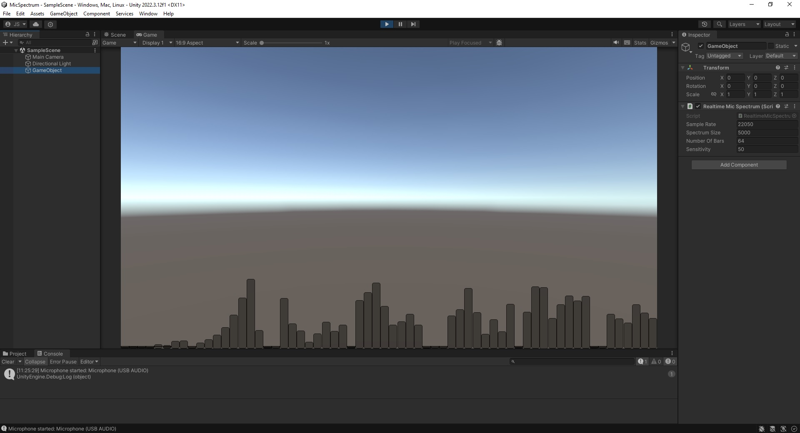
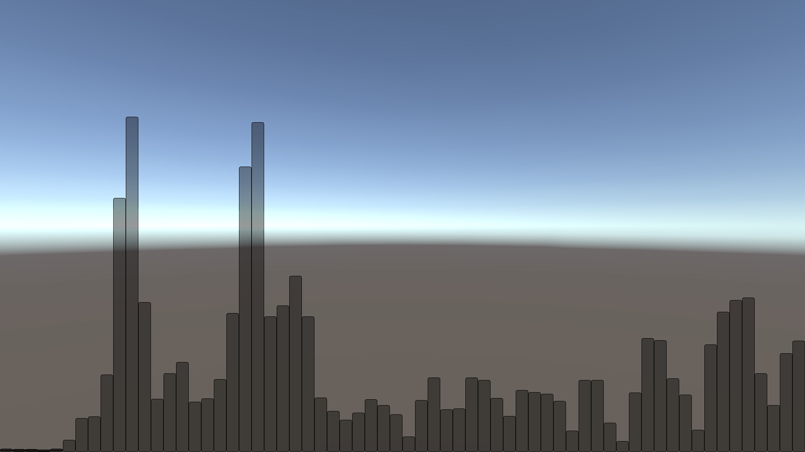

# RealtimeMicSpectrum - Realtime Audio Spectrum Visualization in Unity

RealtimeMicSpectrum is a Unity script for real-time visualization of microphone or line-in audio spectrum analysis data. This project does not use `AudioSource` or `AudioListener` components, nor does it rely on third-party packages. It also avoids delay issues and bugs when focusing off the window when 'run in background' setting is enabled.

## Features

- Real-time audio spectrum visualization.
- No dependency on `AudioSource` or `AudioListener`.
- Avoids delay issues when the application window is not in focus.
- Uses Fast Fourier Transform (FFT) for spectrum analysis.
- Simple and clean visualization using Unity's GUI system.




## Getting Started

- Made and tested with Unity 2022.3.12f1 but will likely work with older versions too.
- You will need a microphone or line-in device connected to your computer.

### Installation

1. Clone this repository or download the ZIP file and extract it to your Unity project's `Assets` folder.

    ```sh
    git clone https://github.com/shinklej/RealtimeMicSpectrum.git
    ```

2. Open your Unity project and navigate to the `RealtimeMicSpectrum` script.

3. Attach the `RealtimeMicSpectrum` script to a GameObject in your scene.

### Usage

- Adjust the public parameters in the Unity Inspector to suit your needs:
  - `Sample Rate`: The sample rate for audio capture (e.g., 22050 Hz).
  - `Spectrum Size`: The size of the FFT array, must be a power of 2 (e.g., 512, 1024, 2048).
  - `Number of Bars`: The number of bars to display in the spectrum visualization.
  - `Sensitivity`: The sensitivity of the visualization.

### Visualizing Audio

1. Start the Unity scene.
2. The script will automatically start the microphone and begin visualizing the audio spectrum.
3. If no microphone is found, a warning will be logged in the console.

### Stopping the Microphone

The microphone will automatically stop when the GameObject is destroyed or disabled. You can also manually stop the microphone by calling the `StopMicrophone` method in the script.

## Contributing

Contributions are welcome! Please open an issue or submit a pull request for any improvements or bug fixes.

## Acknowledgements

Special thanks to the Unity community for their support and resources.

